# fork 

首先，你需要在 GitHub 上 fork 本项目到你的仓库。

# 修改配置

修改`.env`文件中的配置，如图

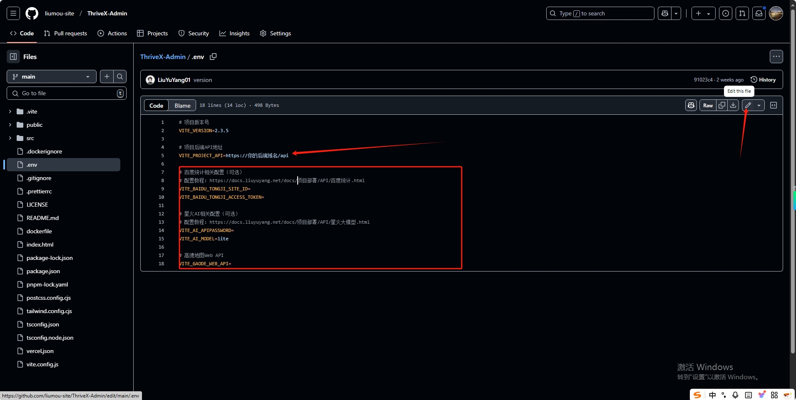

将参数都改好之后保存

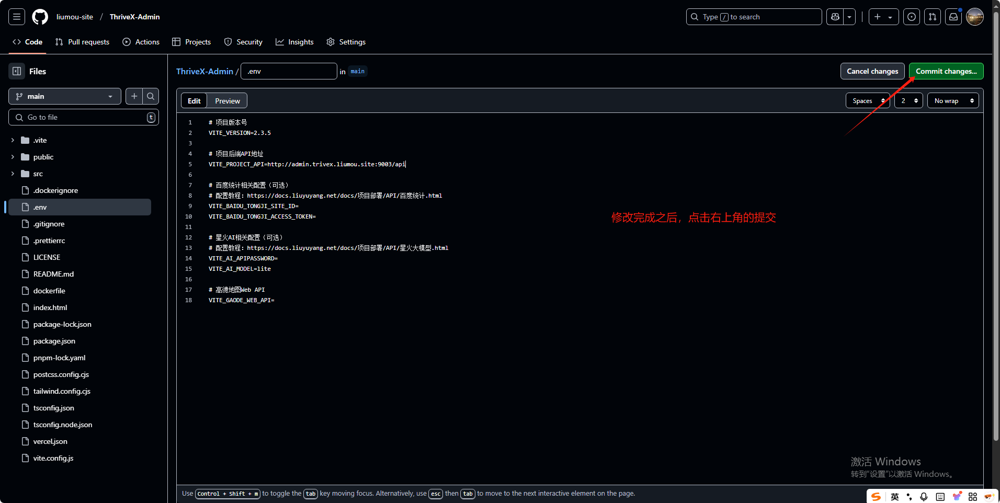


# 构建镜像(阿里云)

[阿里云](https://www.aliyun.com/)


## 容器镜像服务

登录成功之后在搜索框中输入`容器镜像服务`，点击进入
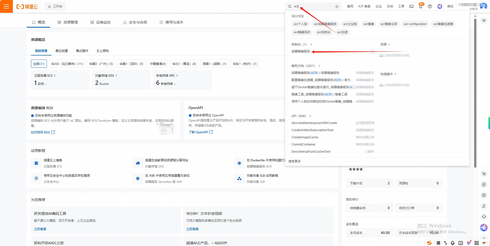


## 进入个人版


## 创建命名空间

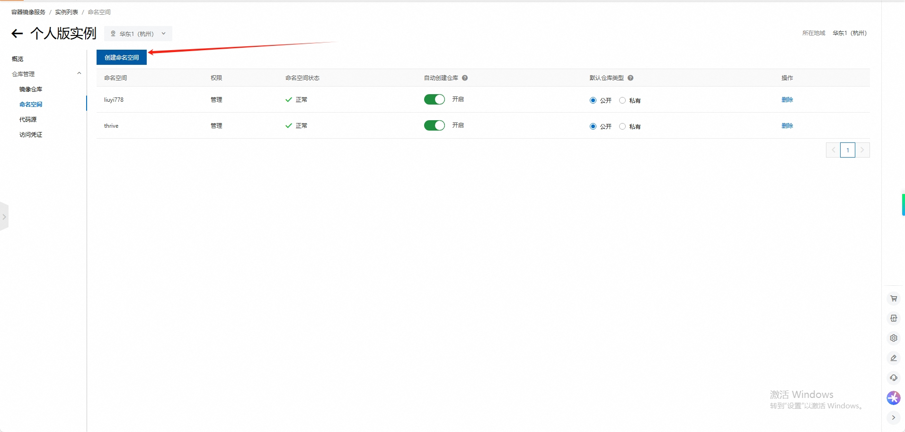

> 名称随意，这里我取的是`trive`

## 设置镜像仓库

选择对应平台,然后绑定自己的账号即可,由于我之前绑定过,所以就不演示了

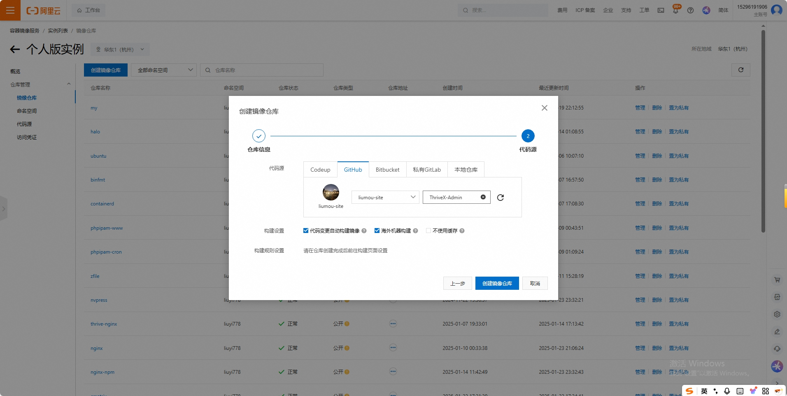

> 选择对应的命名空间及仓库之后就完成基本配置了

## 镜像信息

创建之后会自动跳转到镜像信息页面

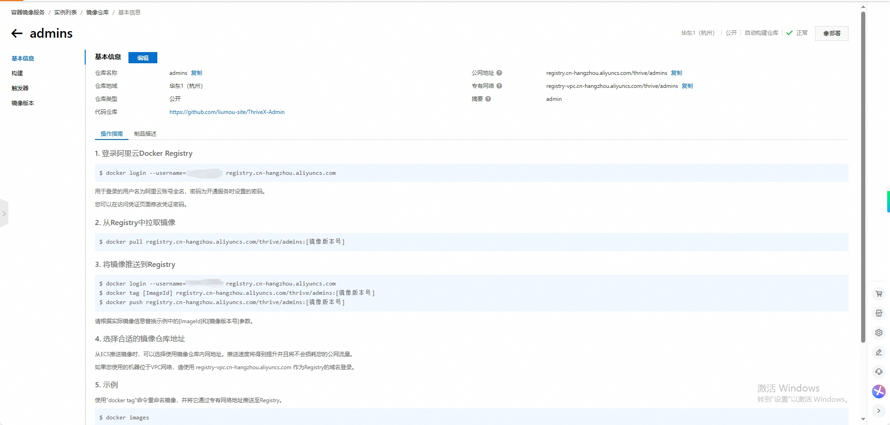


## 构建

点击`构建`功能,然后参考下面的信息填写

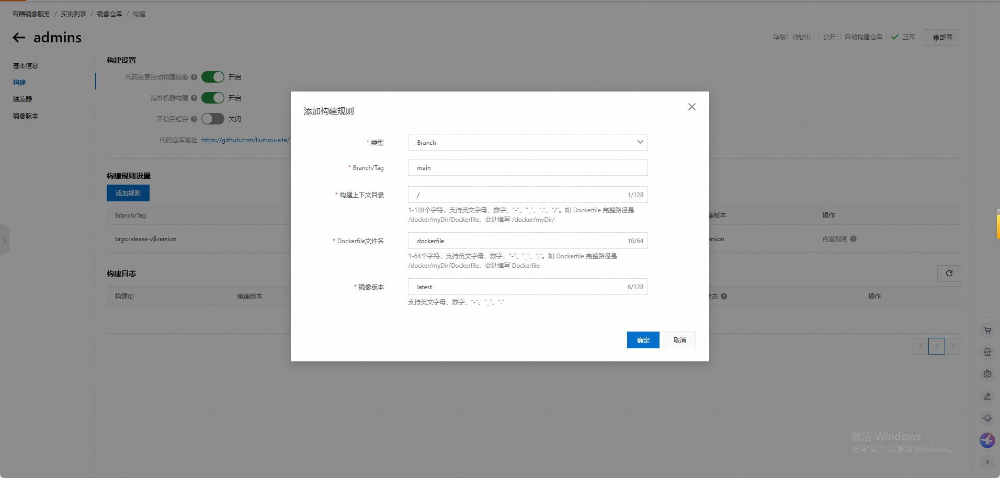


## 开始构建

首次添加规则需要手动触发一次构建,后续代码变更都会自动构建,无需手动触发

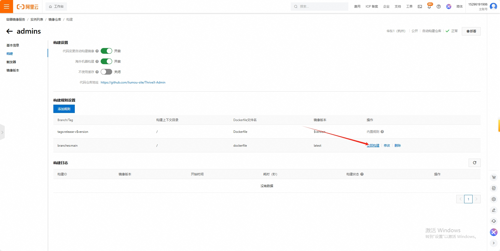

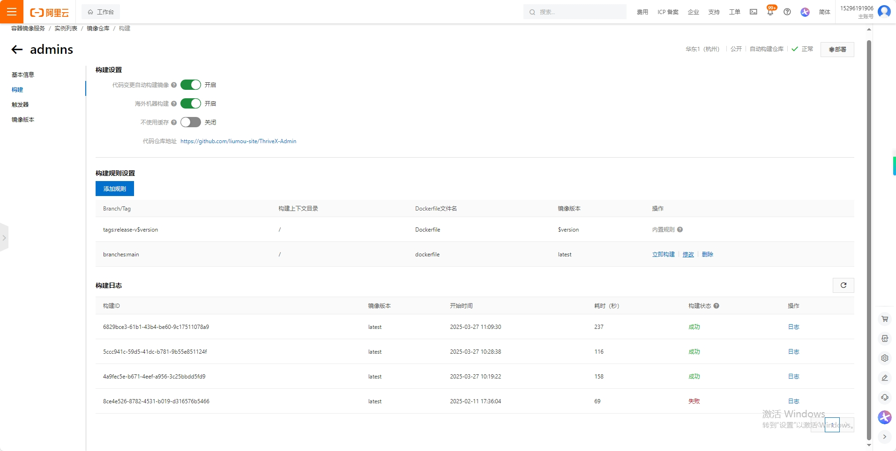

## 运行容器

### 拉取容器

```shell
docker pull registry.cn-hangzhou.aliyuncs.com/thrive/admins
```

> 实际镜像请复制自己的,不要直接使用我的

### 运行

```shell
docker run -tid --name admin -p 1980:80  registry.cn-hangzhou.aliyuncs.com/thrive/admins
```

效果
```shell
root@tb4:~# docker run -tid --name admin -p 1980:80  registry.cn-hangzhou.aliyuncs.com/thrive/admins
444f70c769706d4171b2fa20097b8bd46b545519ed7c3aef974cc8892e0b2df8
root@tb4:~# 
```

### 查看运行日志

```shell
root@tb4:~# docker logs -f admin 
/docker-entrypoint.sh: /docker-entrypoint.d/ is not empty, will attempt to perform configuration
/docker-entrypoint.sh: Looking for shell scripts in /docker-entrypoint.d/
/docker-entrypoint.sh: Launching /docker-entrypoint.d/10-listen-on-ipv6-by-default.sh
10-listen-on-ipv6-by-default.sh: info: Getting the checksum of /etc/nginx/conf.d/default.conf
10-listen-on-ipv6-by-default.sh: info: Enabled listen on IPv6 in /etc/nginx/conf.d/default.conf
/docker-entrypoint.sh: Sourcing /docker-entrypoint.d/15-local-resolvers.envsh
/docker-entrypoint.sh: Launching /docker-entrypoint.d/20-envsubst-on-templates.sh
/docker-entrypoint.sh: Launching /docker-entrypoint.d/30-tune-worker-processes.sh
/docker-entrypoint.sh: Configuration complete; ready for start up
2025/03/27 03:17:24 [notice] 1#1: using the "epoll" event method
2025/03/27 03:17:24 [notice] 1#1: nginx/1.27.4
2025/03/27 03:17:24 [notice] 1#1: built by gcc 14.2.0 (Alpine 14.2.0) 
2025/03/27 03:17:24 [notice] 1#1: OS: Linux 6.8.12-5-pve
2025/03/27 03:17:24 [notice] 1#1: getrlimit(RLIMIT_NOFILE): 1048576:1048576
2025/03/27 03:17:24 [notice] 1#1: start worker processes
2025/03/27 03:17:24 [notice] 1#1: start worker process 30
2025/03/27 03:17:24 [notice] 1#1: start worker process 31
2025/03/27 03:17:24 [notice] 1#1: start worker process 32
2025/03/27 03:17:24 [notice] 1#1: start worker process 33
```
## 访问

```shell
root@tb4:~# curl localhost:1980
<!DOCTYPE html>
<html lang="zh-CN">
  <head>
    <meta charset="UTF-8" />
    <link rel="icon" type="image/svg+xml" href="/favicon.ico" />
    <meta name="viewport" content="width=device-width, initial-scale=1.0" />
    <title>ThriveX 现代化博客管理系统</title>
    <script type="module" crossorigin src="/assets/index-7fd51f0f.js"></script>
    <link rel="stylesheet" href="/assets/index-7f9f685f.css">
  </head>
  <body>
    <div id="root"></div>
    
  </body>
</html>
root@tb4:~# 
```

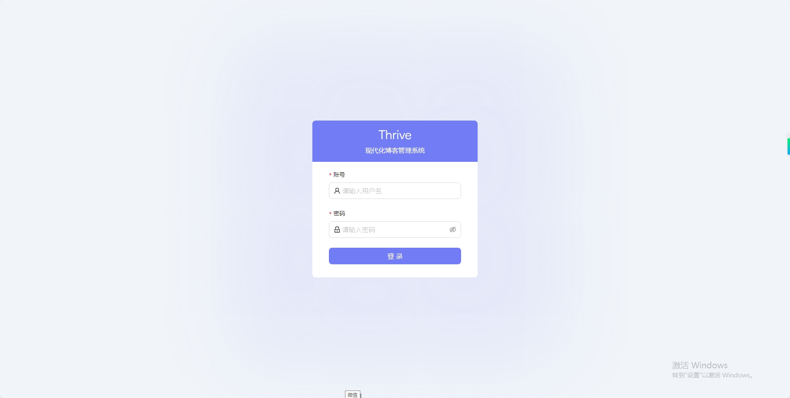

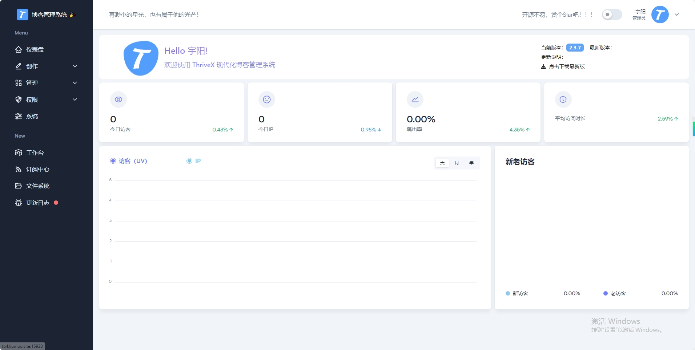


至此部署完成